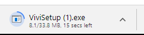
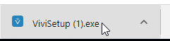
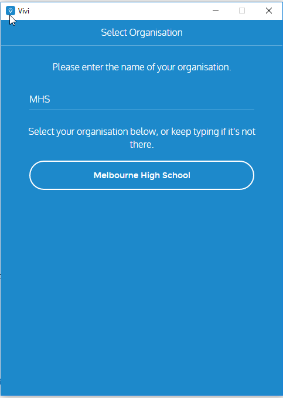
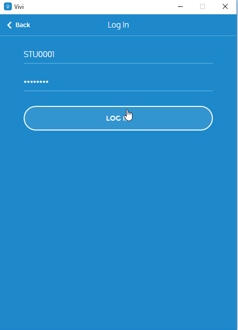
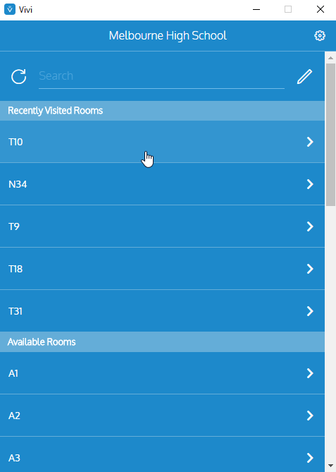
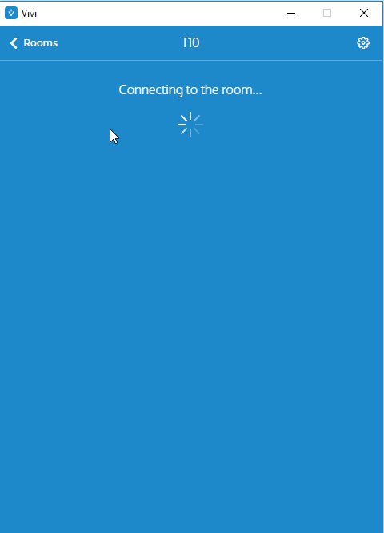

Download Vivi from [http://get.vivi.io/](http://get.vivi.io/).

Vivi should now be downloading:

Run ViviSetup.exe.

If a notification appears asking if you trust the publisher, press YES.
Follow the on-screen prompts.

Launch Vivi.
When asked for your Organisation name, type MHS and **not** Melbourne High School.

Press confirm.

Log in with your MHS Credentials (used to sign into Compass).

## Connecting to a room
Select a room.

Vivi will take a moment to connect.

