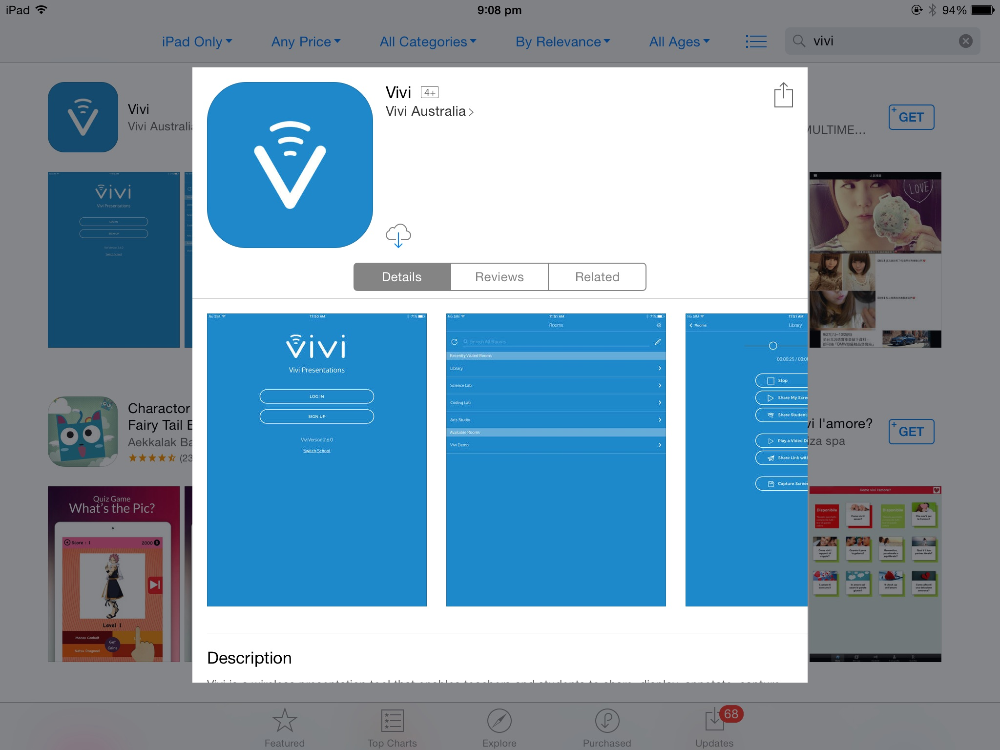
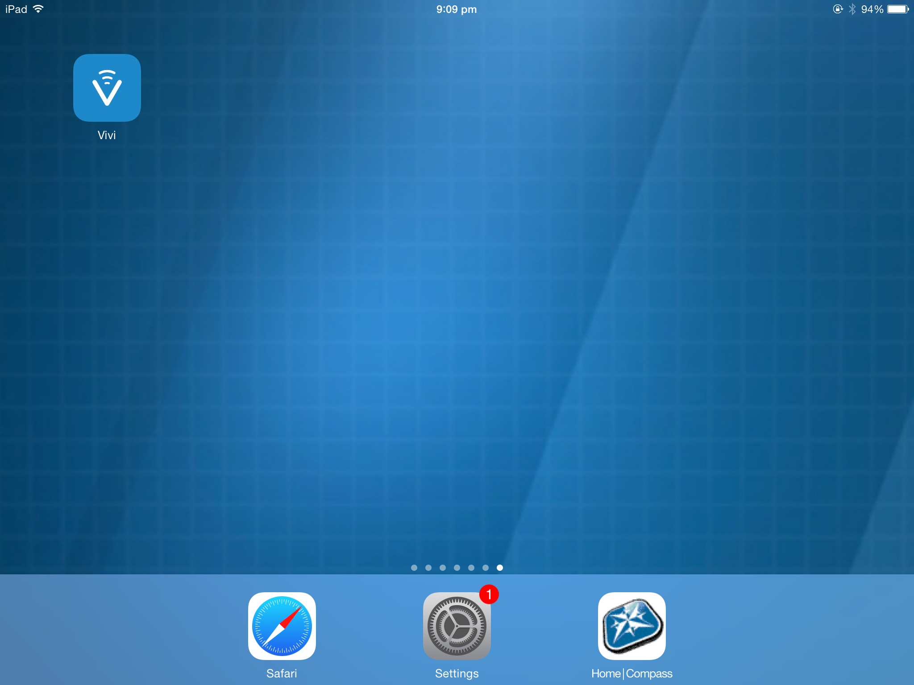
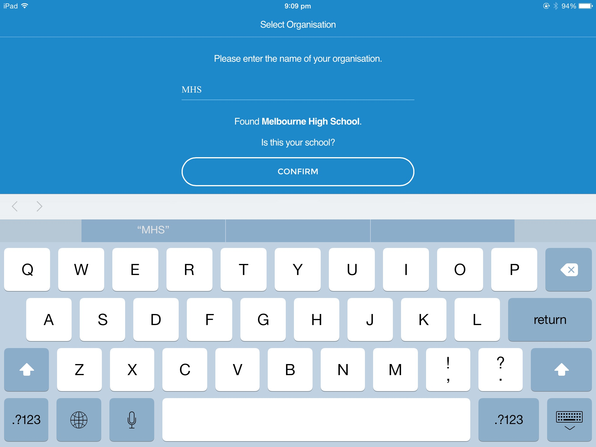
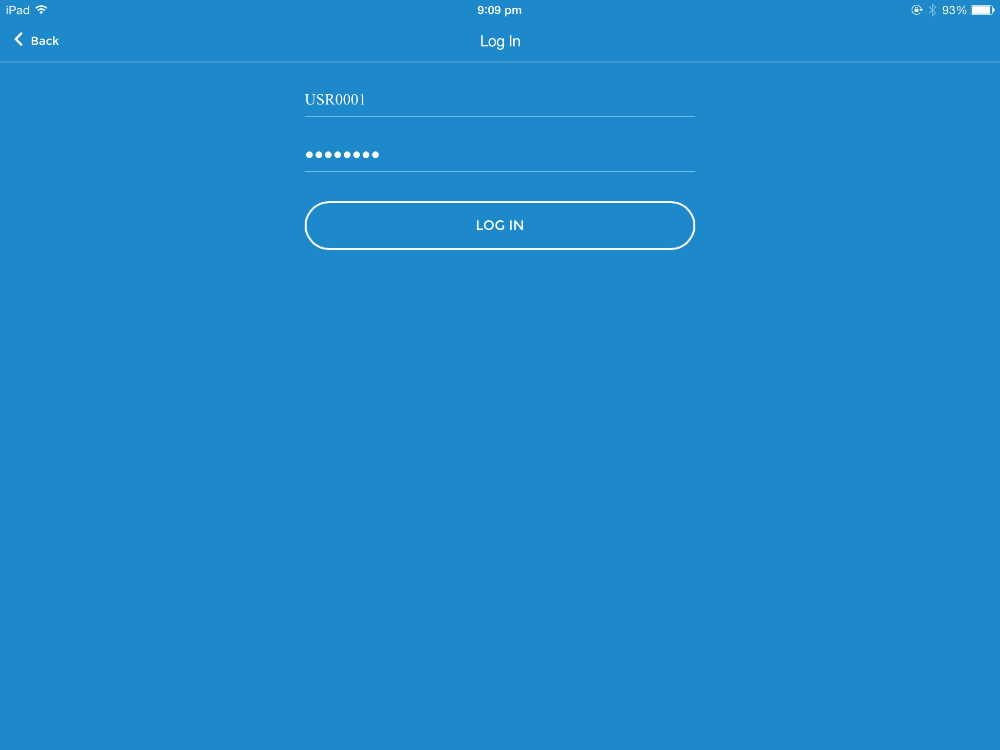
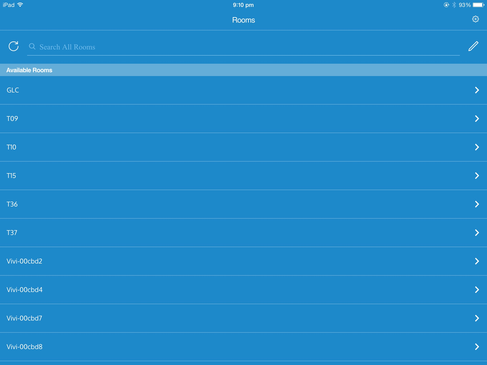

Download Vivi from [http://get.vivi.io/](http://get.vivi.io/) or the App Store.

Run the Vivi app.

When asked for your organisation name, type MHS and **not** Melbourne High School.

Press Confirm.

Log in with your Melbourne High School Credentials (used to sign into Compass).

Select a room and connect.

Swipe up from the bottom of your screen and select Airplay. The room should now be there.

Note: Jailbroken devices will not work with Vivi.

Note: Do not switch apps before airplaying. Doing so will break Vivi.
